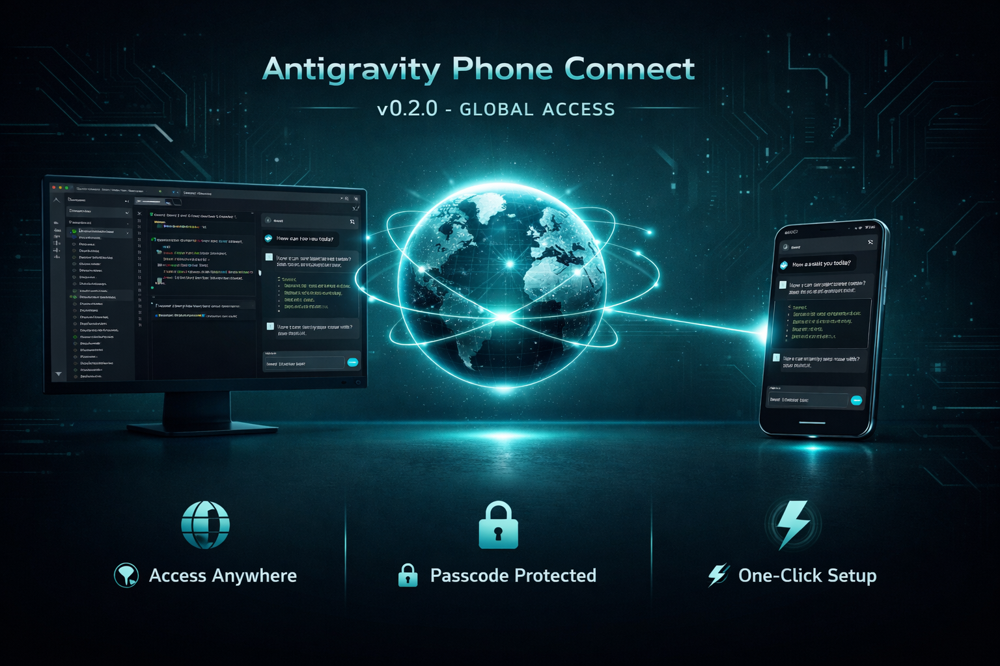
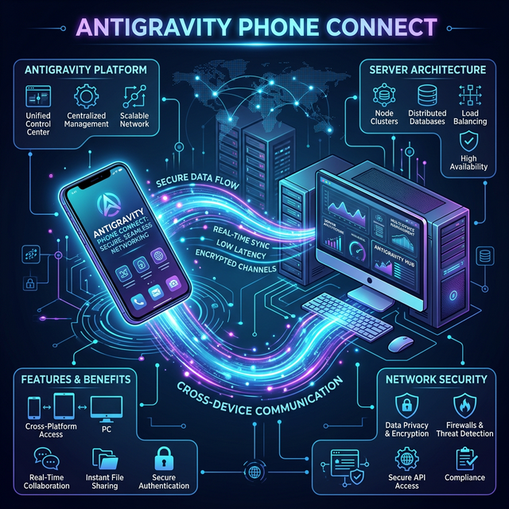
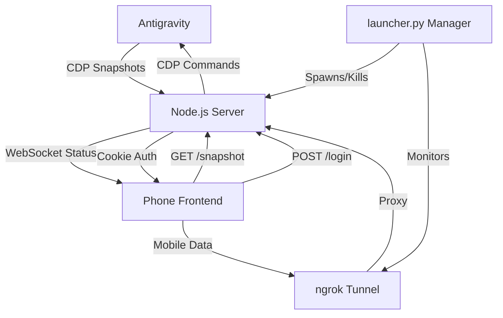

<div align="center">
  
  <h1>Antigravity Phone Connect 📱</h1>
</div>

[](https://www.gnu.org/licenses/gpl-3.0)

**Antigravity Phone Connect** is a high-performance, real-time mobile monitor and remote control for your Antigravity AI sessions. It allows you to step away from your desk while keeping full sight and control over your AI's thinking process and generations.



**Note:** This project is a refined fork/extension based on the original [Antigravity Shit-Chat](https://github.com/gherghett/Antigravity-Shit-Chat) by gherghett.

---

## 🚀 Quick Start

> 💡 **Tip:** While we recommend starting Antigravity first, the server is now smart enough to wait and automatically connect whenever Antigravity becomes available!

### Step 1: Launch Antigravity in Debug Mode

Start Antigravity with the remote debugging port enabled:

**Option A: Using Right-Click Context Menu (Recommended)**
- Run `install_context_menu.bat` (Windows) or `./install_context_menu.sh` (Linux) and select **[1] Install**
- Then right-click any project folder → **"Open with Antigravity (Debug)"** (now with visual icons!)

**Option B: Manual Command**
```bash
antigravity . --remote-debugging-port=9000
```

### Step 2: Open or Start a Chat

- In Antigravity, open an **existing chat** from the bottom-right panel, **OR**
- Start a **new chat** by typing a message

> 💡 The server needs an active chat session to capture snapshots. Without this, you'll see "chat container not found" errors.

### Step 3: Run the Server

**Windows (Quick - if Antigravity already open with debug port):**
```
Double-click run.bat
```

**Windows (Full - restarts Antigravity):**
```
Double-click start_ag_phone_connect.bat
```

**macOS / Linux:**
```bash
chmod +x start_ag_phone_connect.sh   # First time only
./start_ag_phone_connect.sh
```

The script will:
- Verify Node.js and Python dependencies
- Auto-kill any existing server on port 3000
- **Wait for Antigravity** if it's not started yet
- Display a **QR Code** and your **Link** (e.g., `https://192.168.1.5:3000`)
- Provide numbered steps for easy connection

### Step 4: Connect Your Phone (Local Wi-Fi)

1. Ensure your phone is on the **same Wi-Fi network** as your PC
2. Open your mobile browser and enter the **URL shown in the terminal**
3. If using HTTPS: Accept the self-signed certificate warning on first visit

---

## 🌍 Global Remote Access (Web Mode)

Access your Antigravity session from **anywhere in the world** (Mobile Data, outside Wi-Fi) with secure passcode protection.

### Setup (First Time)
1. **Get an ngrok Token**: Sign up for free at [ngrok.com](https://ngrok.com) and get your "Authtoken".
2. **Automatic Configuration (Recommended)**: Simply run any launcher script. They will detect if `.env` is missing and automatically create it using `.env.example` as a template.
3. **Manual Setup**: Alternatively, copy `.env.example` to `.env` manually and update the values:
   ```bash
   copy .env.example .env   # Windows
   cp .env.example .env     # Mac/Linux
   ```
   Update the `.env` file with your details:
   ```env
   NGROK_AUTHTOKEN=your_token_here
   APP_PASSWORD=your_secure_passcode
   XXX_API_KEY=your-ai-provider-key
   PORT=3000
   ```

### Usage
- **Windows**: Run `start_ag_phone_connect_web.bat`
- **Mac/Linux**: Run `./start_ag_phone_connect_web.sh`

The script will launch the server and provide a **Public URL** (e.g., `https://abcd-123.ngrok-free.app`). 

**Two Ways to Connect:**
1. **Magic Link (Easiest)**: Scan the **Magic QR Code** displayed in the terminal. It logs you in automatically!
2. **Manual**: Open the URL on your phone → Enter your `APP_PASSWORD` to log in.

> 💡 **Tip:** Devices on the same local Wi-Fi still enjoy direct access without needing a password.

---

## 🔒 Enabling HTTPS (Recommended)

### Option 1: Command Line
```bash
node generate_ssl.js
```
- Uses **OpenSSL** if available (includes your IP in certificate)
- Falls back to **Node.js crypto** if OpenSSL not found
- Creates certificates in `./certs/` directory

### Option 2: Web UI
1. Start the server on HTTP
2. Look for the yellow **"⚠️ Not Secure"** banner
3. Click **"Enable HTTPS"** button
4. Restart the server when prompted

### After Generating:
1. **Restart the server** - it will automatically detect and use HTTPS.
2. **On your phone's first visit**: Tap **"Advanced"** → **"Proceed to site"** (normal for self-signed certs, won't appear again).

### macOS: Adding Right-Click "Quick Action" (Optional)

1. Open **Automator** → File → New → **Quick Action**
2. Set: "Workflow receives current" → **folders**, "in" → **Finder**
3. Add **"Run Shell Script"** action, Shell: `/bin/zsh`, Pass input: **as arguments**
4. Paste: `cd "$1" && antigravity . --remote-debugging-port=9000`
5. Save as `Open with Antigravity (Debug)`

---

## 🏗️ Architecture



### Project Structure
```text
antigravity_phone_chat/
├── server.js                       # Main Node.js server (Express + WebSocket + CDP + HTTPS)
├── generate_ssl.js                 # SSL certificate generator (pure Node.js, no OpenSSL needed)
├── ui_inspector.js                 # Utility for inspecting Antigravity UI via CDP
├── public/
│   ├── index.html                  # Mobile-optimized web frontend
│   ├── css/
│   │   └── style.css               # Main stylesheet
│   └── js/
│       └── app.js                  # Client-side logic (WebSocket, API calls, UI interactions)
├── certs/                          # SSL certificates directory (auto-generated, gitignored)
├── start_ag_phone_connect.bat      # Standard Windows launcher (LAN)
├── start_ag_phone_connect_web.bat  # Web Windows launcher (Server + Global Tunnel)
├── start_ag_phone_connect.sh       # Standard Mac/Linux launcher (LAN)
├── start_ag_phone_connect_web.sh   # Web Mac/Linux launcher (Server + Global Tunnel)
├── run.bat                         # Quick launcher (Antigravity already open with debug port)
├── launch.bat                      # Full launcher (Restarts Antigravity + Server)
├── install_context_menu.bat        # Windows Context Menu installer/manager
├── install_context_menu.sh         # Linux Context Menu installer
├── launcher.py                     # Unified Python launcher (Server, Tunnel, QR Codes)
├── .env                            # Local configuration (gitignored)
├── .env.example                    # Template for environment variables
├── package.json                    # Dependencies and metadata
└── LICENSE                         # GPL v3 License
```

### Data Flow


### Core Modules (server.js)

| Module/Function | Description |
| :--- | :--- |
| `killPortProcess()` | Auto-kills existing process on server port (prevents EADDRINUSE) |
| `getLocalIP()` | Detects local network IP for mobile access display |
| `discoverCDP()` | Scans ports 9000-9003 to find Antigravity instance |
| `connectCDP()` | CDP WebSocket with centralized message handling, `pendingCalls` Map with 30s timeout |
| `captureSnapshot()` | Clones chat DOM, converts local images/SVGs to Base64, extracts CSS |
| `injectMessage()` | Locates input field and simulates typing/submission via `JSON.stringify` |
| `setMode()` / `setModel()` | Text-based selectors to change AI settings remotely |
| `clickElement()` | Deterministic targeting with text-anchoring, leaf-most filtering, and occurrence index tracking |
| `remoteScroll()` | Syncs phone scroll position to Desktop Antigravity chat |
| `getAppState()` | Syncs Mode/Model status and detects history visibility |
| `getChatHistory()` | Strictly scoped DOM scraping of conversation titles |
| `gracefulShutdown()` | Handles SIGINT/SIGTERM for clean server shutdown |

---

## ✨ Features

- **🧹 Clean Mobile View**: Filters out "Review Changes" bars, "Linked Objects," and Desktop-specific input areas
- **Glassmorphism UI**: Sleek quick-action and settings menus with glassmorphism effect, customizable prompt pills
- **🌙 Improved Dark Mode**: Enhanced styling and state capture for maximum clarity in dark mode
- **🧠 Latest AI Models**: Auto-updated support for Gemini, Claude, and OpenAI
- **📜 Premium Chat History**: Full-screen history with card-based UI, gradient icons, and intelligent scoping
- **➕ One-Tap New Chat**: Start fresh conversations from your phone
- **🖼️ Context Menu Icons**: Visual icons in the right-click menu
- **🌍 Global Web Access**: Secure remote access via ngrok tunnel with passcode protection
- **🛡️ Auto-Cleanup**: Launchers sweep away "ghost" processes for a clean start
- **🔒 HTTPS Support**: Self-signed SSL certificates
- **Local Image Support**: `vscode-file://` paths auto-converted to Base64
- **Real-Time Mirroring**: 1-second polling for near-instant sync
- **Remote Control**: Send messages, stop generations, switch Modes/Models from phone
- **Scroll Sync**: Phone scroll syncs to desktop Antigravity
- **🎯 Precision Remote Control**: Deterministic targeting with leaf-node filtering and occurrence index tracking
- **Thought Expansion**: Tap "Thinking..." blocks to remotely expand/collapse them
- **Smart Sync**: Bi-directional Mode/Model synchronization
- **Health Monitoring**: Built-in `/health` endpoint
- **Graceful Shutdown**: Clean exit on Ctrl+C
- **Zero-Config**: Launch scripts handle environment setup automatically

---

## 📡 API Endpoints

| Endpoint | Method | Description |
| :--- | :--- | :--- |
| `/login` | POST | Authenticates user and sets session cookie |
| `/logout` | POST | Clears session cookie |
| `/health` | GET | Server status, CDP connection state, and uptime |
| `/snapshot` | GET | Latest captured HTML/CSS snapshot |
| `/app-state` | GET | Current Mode and Model selection |
| `/ssl-status` | GET | HTTPS status and certificate info |
| `/send` | POST | Sends a message to Antigravity chat (always returns 200) |
| `/stop` | POST | Stops current AI generation |
| `/set-mode` | POST | Changes mode to Fast or Planning |
| `/set-model` | POST | Changes the AI model |
| `/new-chat` | POST | Starts a new chat session |
| `/chat-history`| GET | List of conversation titles |
| `/select-chat` | POST | Switches desktop to selected conversation |
| `/close-history` | POST | Closes desktop history panel via Escape keypress |
| `/chat-status` | GET | Status of chat container and editor |
| `/remote-click` | POST | Triggers click on Desktop (tag, text, occurrence index) |
| `/remote-scroll` | POST | Syncs phone scroll to Desktop |
| `/generate-ssl` | POST | Generates SSL certificates via UI |
| `/debug-ui` | GET | Serialized UI tree for debugging |
| `/ui-inspect` | GET | Button and icon metadata for development |
| `/cdp-targets` | GET | Available CDP discovery targets |

---

## 🔒 Security

### Security Audit (OWASP Scope - 2026-02-27)

| Area | Status | Notes |
| :--- | :--- | :--- |
| Secrets Management | ⚠️ Warning | `.env` used for secrets; fallback defaults exist but launchers enforce `.env` generation |
| Injection (XSS/SQLi) | ✅ Passed | DOM cloned from CDP; `escapeHtml()` sanitizes chat history titles |
| Authentication | ✅ Passed | Zero-Trust for external IPs; `httpOnly` signed cookies; LAN auto-authorized |
| Dependencies | ✅ Passed | Clean dependency chain (`express`, `ws`, `cookie-parser`, `dotenv`) |

### Security Model
- **Session Management**: Signed, `httpOnly` cookies for maximum browser security
- **Conditional Auth**: LAN requests auto-exempted from password checks
- **WebSocket Auth**: Credentials verified during handshake
- **Input Sanitization**: `JSON.stringify` escaping before CDP injection
- **Output Encoding**: `escapeHtml()` utility prevents XSS on history titles
- **Self-Signed Certificates**: Browsers show warning on first visit only

### Tunneling (Web Mode)
- **Unified Manager**: `launcher.py` spawns Node.js server as child process
- **Magic Links**: QR code with embedded `?key=PASSWORD` for instant auto-login
- **Auto-Protocol Detection**: Detects HTTPS and configures tunnel accordingly
- **Passcode Generation**: Temporary 6-digit passcode if no `APP_PASSWORD` set

---

## 🎨 Design Philosophy

### Problem Statement
Developing with powerful AI models in Antigravity often involves long "thinking" times. Developers are "tethered" to their desks, waiting for a prompt to finish.

### Solution
Antigravity Phone Connect is a **wireless viewport** — not a replacement for the desktop IDE. It mirrors the state of the desktop session to any device on the local network.

### Principles
1. **Robustness Over Precision**: Text-based selection with fuzzy matching + occurrence index tracking + leaf-node isolation for 100% click accuracy
2. **Zero-Impact Mirroring**: DOM cloned before capture, no interference with desktop focus/scroll
3. **Visual Parity**: Aggressive CSS inheritance with glassmorphism and dark mode bridge
4. **Security-First**: HTTPS by default, hybrid SSL generation, LAN auto-auth + secure tunneling
5. **Mobile-First Navigation**: Full-screen history layer with premium cards and bi-directional sync

### Technical Details
- **Snapshot Polling**: 1000ms interval with 36-char hash delta detection
- **Interaction Latency**: < 100ms overhead for POST interactions
- **Scroll Sync**: Phone → Desktop only (prevents "sync-fighting")
- **User Lock**: 3000ms protection on touch; 5000ms idle → auto-scroll resumes

---

## 🤝 Contributing

### How to Contribute
1. **Report Bugs**: Check existing issues, provide OS/port/protocol context + console logs
2. **Suggest Features**: Open a "Feature Request" on GitHub
3. **Submit Code**:
   - Fork → Create branch (`git checkout -b feature/amazing-feature`) → Implement → Submit PR

### Local Setup
```bash
git clone https://github.com/krishnakanthb13/antigravity_phone_chat.git
npm install
node generate_ssl.js          # Optional
antigravity . --remote-debugging-port=9000
node server.js
```

### Pre-submission Checklist
- [ ] Code follows existing style (clean, documented JS)
- [ ] No hardcoded personal IPs or credentials
- [ ] SSL certificates are NOT committed
- [ ] Snapshot capture works with latest Antigravity
- [ ] UI is responsive on small (iPhone SE) and large (iPad) screens
- [ ] Both HTTP and HTTPS modes work correctly
- [ ] Shell scripts have LF line endings (not CRLF)

---

## 📦 Changelog

### v0.2.28 - UI/UX Pro Max & The Obsidian Overhaul 💎 (Feb 27, 2026)
- "Space Black" palette with violet-to-indigo gradients
- Glassmorphic prompt pills with micro-animations
- New "Explain" quick-action pill
- OWASP security audit completed
- Perfect desktop-mobile history sync

### v0.2.24 - Deterministic Targeting & Security Hardening 🎯 (Feb 26, 2026)
- Deterministic targeting engine with occurrence index tracking
- Leaf-most filtering ("Zero-Proxy Filter")
- Strict scoped clicking within chat cascade
- Hardcoded secrets externalized to `.env`

### v0.2.21 - Deep Integration & Visual Fidelity 🚀 (Feb 26, 2026)
- Remote "Run"/"Reject" command actions
- Base64 image conversion for flawless remote rendering
- Full mobile chat history integration

### v0.2.17 - UI Polish & Model Compatibility 🌟 (Feb 20, 2026)
- Glassmorphism UI for quick actions/settings
- Enhanced dark mode tracking
- Latest AI model support verified

### v0.2.13 - Smart Cleanup & Reliability 🛡️ (Feb 7, 2026)
- Aggressive DOM cleanup (Review Changes, Linked Objects)
- Multi-strategy model selector
- Smart container detection (legacy + newer IDs)

### v0.2.6 - Full-Screen History & Visual Upgrades 📜 (Feb 1, 2026)
- Full-screen history layer for mobile
- Remote conversation switching
- Visual context menu icons

### v0.2.1 - Magic Links & Unified Launcher ✨ (Jan 21, 2026)
- QR code magic auto-login
- Unified `launcher.py` for Local/Web modes

### v0.2.0 - Global Remote Access 🌍 (Jan 21, 2026)
- ngrok tunneling for worldwide access
- Password protection with auto-generation
- Gzip compression for mobile data

### v0.1.7 - Robustness & Stability 🛡️ (Jan 21, 2026)
- Auto-recovery and resilient startup
- Throttled logging and actionable error hints

### v0.1.6 - Mobile Copy & Stability 📋 (Jan 20, 2026)
- One-tap code block copy button
- Automatic port cleanup

### v0.1.5 - HTTPS & Scroll Sync 🔒 (Jan 17, 2026)
- HTTPS support with hybrid SSL generation
- Bi-directional scroll sync

### v0.1.0 - Initial Release 🎉 (Jan 17, 2026)
- Real-time mirroring, remote control, thought expansion
- Premium dark-themed mobile UI, context menu integration

---

## 📋 Requirements

- **Node.js**: v16.0.0 or higher
- **Network**: Phone and PC on same Wi-Fi (or use Web Mode)
- **Antigravity**: Running with `--remote-debugging-port=9000`

| Platform | Launcher Script | Context Menu Script |
|:---------|:----------------|:--------------------|
| **Windows** | `start_ag_phone_connect.bat` / `run.bat` | `install_context_menu.bat` |
| **macOS** | `start_ag_phone_connect.sh` | Manual Automator setup |
| **Linux** | `start_ag_phone_connect.sh` | `install_context_menu.sh` |

---

## License

Licensed under the [GNU GPL v3](LICENSE).  
Copyright (C) 2026 **Krishna Kanth B** (@krishnakanthb13)

---

## Star History

<a href="https://www.star-history.com/#krishnakanthb13/antigravity_phone_chat&type=date&legend=top-left">
 <picture>
   <source media="(prefers-color-scheme: dark)" srcset="https://api.star-history.com/svg?repos=krishnakanthb13/antigravity_phone_chat&type=date&theme=dark&legend=top-left" />
   <source media="(prefers-color-scheme: light)" srcset="https://api.star-history.com/svg?repos=krishnakanthb13/antigravity_phone_chat&type=date&legend=top-left" />
   
 </picture>
</a>
